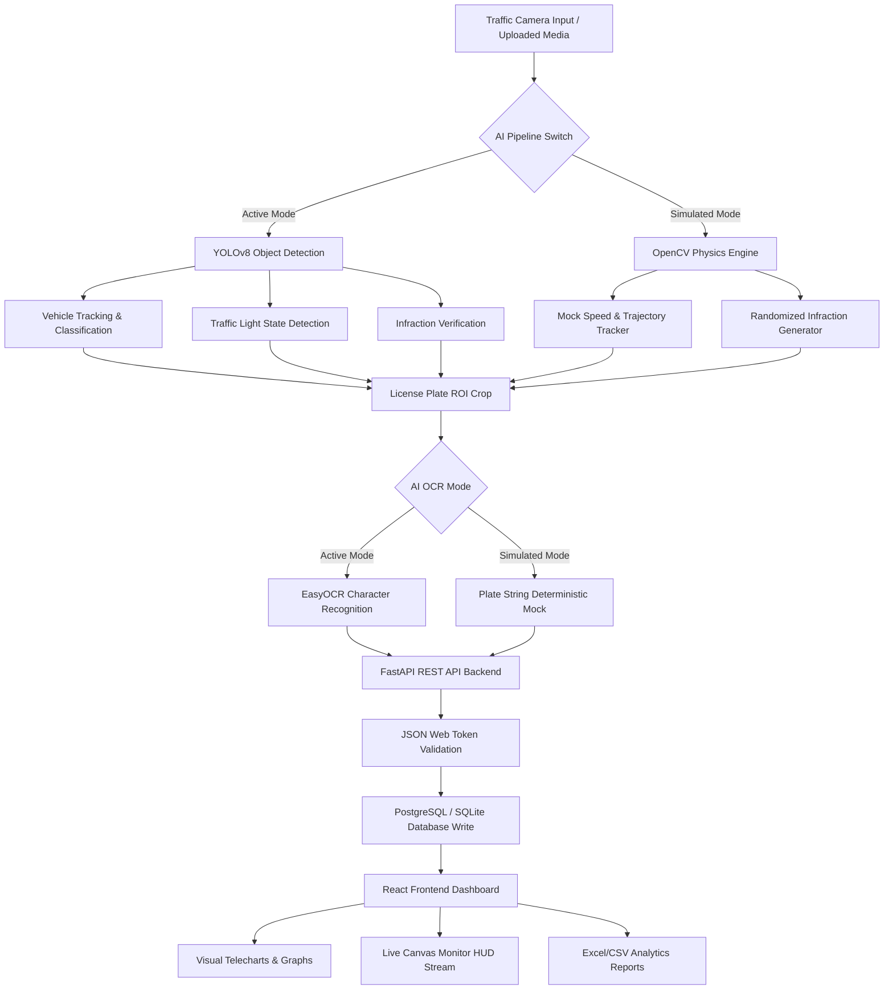

# 🚦 AI-Powered Smart Traffic Violation Detection System

A production-quality, smart city government dashboard designed for automated traffic violation monitoring, vehicle tracking, license plate recognition (OCR), and fine administration.

---

## 🏗️ Core Technology Stack

### Frontend Hub
- **React (Vite + TypeScript)**: Type-safe, high-performance UI structure.
- **Tailwind CSS v4**: Built natively with the `@tailwindcss/vite` compiler plugin for sleek grid designs.
- **Framer Motion**: Smooth micro-animations, slide-over sheets, and alert transitions.
- **Recharts**: Responsive chart libraries for monthly/daily violations, vehicle ratios, and collections.
- **React Router**: Protected router guards with role-based validation.
- **Lucide Icons**: Modern vector icon libraries for HUD status dashboards.

### API Backend
- **FastAPI**: Asynchronous Python web framework with auto-generated Swagger UI docs.
- **SQLAlchemy ORM**: Database mapping configurations.
- **Python-Multipart & Uvicorn**: Direct media upload handling and HTTP server.
- **Pandas & Openpyxl**: Dynamic CSV/XLSX export spreadsheets creation.

### Database Layer
- **SQLite**: Local file database for zero-config rapid local runs.
- **PostgreSQL**: Production-ready containerized relational database.

### AI Inference Pipeline (Dual-Mode)
- **YOLOv8**: Object tracking models mapping vehicle boxes and signal lights.
- **EasyOCR**: Optical Character Recognition engine isolating license plate numbers.
- **OpenCV**: Image overlays, cropping, and dynamic HTML5 Canvas rendering.

---

## ⚙️ How the AI Pipeline Works

The system includes a **Dual-Mode AI Engine** configurable via settings to accommodate different hardware resources:



---

## 📂 Project Structure

```
Traffic Violation/
├── backend/
│   ├── app/
│   │   ├── ai/
│   │   │   └── detector.py       # YOLOv8 & EasyOCR model switch
│   │   ├── auth/
│   │   │   └── jwt.py            # JWT token creation and password hashes
│   │   ├── routes/
│   │   │   ├── auth.py           # Login, registration, and user profiles
│   │   │   ├── violations.py     # Image/Video upload endpoints
│   │   │   ├── cameras.py        # CCTV registration controllers
│   │   │   ├── dashboard.py      # Summary metrics resolvers
│   │   │   ├── analytics.py      # Charts and spreadsheet exporters
│   │   │   ├── users.py          # Officer administration controls
│   │   │   └── settings.py       # Fine amounts and AI threshold config
│   │   ├── config.py             # System directories and configurations
│   │   ├── database.py           # DB connection sessions
│   │   ├── models.py             # Database SQLAlchemy schemas
│   │   └── main.py               # Main entry point & static folder mounts
│   ├── requirements.txt          # Python dependencies
│   └── Dockerfile                # Backend container config
├── frontend/
│   ├── src/
│   │   ├── components/
│   │   │   ├── Sidebar.tsx       # Collapsible side navigation
│   │   │   └── Topbar.tsx        # Breadcrumbs, themes, notifications, and user logs
│   │   ├── components/ui/        # Reusable shadcn-style primitives
│   │   │   ├── button.tsx
│   │   │   ├── card.tsx
│   │   │   ├── table.tsx
│   │   │   ├── badge.tsx
│   │   │   ├── select.tsx
│   │   │   ├── dialog.tsx
│   │   │   └── tabs.tsx
│   │   ├── pages/
│   │   │   ├── Login.tsx         # Secure login and credentials reset
│   │   │   ├── Dashboard.tsx     # KPI metrics, line/donut charts, and simulation triggers
│   │   │   ├── LiveMonitoring.tsx# Multi-camera grid, filters, and canvas stream
│   │   │   ├── Upload.tsx        # Bounding box crop upload engine
│   │   │   ├── Violations.tsx    # Violations table database with action sheets
│   │   │   ├── Analytics.tsx     # Downloadable data reports dashboard
│   │   │   ├── Map.tsx           # Delhi sectors GPS coordinate map
│   │   │   ├── Cameras.tsx       # Camera registries checklist
│   │   │   ├── Users.tsx         # Officer roles dashboard
│   │   │   └── Settings.tsx      # Fine rules tariff configuration
│   │   ├── App.tsx               # Auth/Theme providers and router guards
│   │   ├── index.css             # Tailwind imports & CSS custom properties
│   │   └── main.tsx              # React Vite entrypoint
│   ├── index.html                # App template index
│   ├── package.json              # Frontend packages
│   └── vite.config.ts            # Vite compilers path resolvers
├── docker-compose.yml            # Multi-service docker orchestration
├── run.bat                       # One-click Windows concurrent launcher
└── README.md                     # Documentation
```

---

## 🔒 Default Logins

On initial launch, the database seeds default credentials:

| Username | Password | Role | Description |
| :--- | :--- | :--- | :--- |
| **`admin`** | `admin123` | **admin** | Access to all logs, officer registrations, and system configurations. |
| **`officer`** | `officer123` | **officer** | Access to dashboards, live camera telemetry, and violation resolution. |

---

## 🚀 Installation & Local Execution

### 1. Python FastAPI Backend
Make sure you have **Python 3.10+** installed:
```bash
# Navigate to backend folder
cd backend

# Create a virtual environment
python -m venv venv
# Activate it (Windows)
.\venv\Scripts\activate
# Activate it (macOS/Linux)
source venv/bin/activate

# Install dependencies
pip install -r requirements.txt

# Start Server
python -m uvicorn app.main:app --reload --port 8000
```
Swagger API docs will be active at [http://localhost:8000/docs](http://localhost:8000/docs).

### 2. Vite React Frontend
Make sure you have **Node.js 18+** installed:
```bash
# Navigate to frontend folder
cd frontend

# Install node dependencies
npm install

# Start Vite dev server
npm run dev
```
Open [http://localhost:5173](http://localhost:5173) in your browser.

---

## 🖥️ Running on Windows (One-Click)
Double-click the `run.bat` script in the root directory. It automatically opens two terminal windows and launches both the backend and frontend dev servers concurrently.

---

## 🐳 Running with Docker
Orchestrate the entire platform (PostgreSQL, FastAPI, and Nginx for React) using:
```bash
docker-compose up --build
```
- **React Portal**: [http://localhost](http://localhost) (Port 80)
- **FastAPI Swagger Docs**: [http://localhost:8000/docs](http://localhost:8000/docs)
