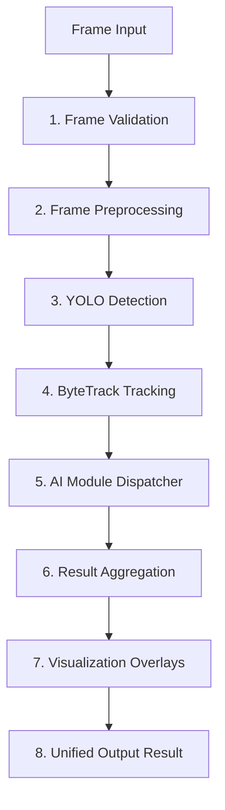

# AI Pipeline Orchestration Framework

This directory houses the centralized AI Pipeline Manager, context structure, and dynamic module registry for the Smart Traffic Violation Detection System.

---

## 🏗️ Architecture & Pipeline Flow

The execution flow for every frame follows 8 distinct, synchronous stages:



1. **Frame Validation**: Checks frame array size, dimensions (3-channel, not empty), and type. If validation fails, processing halts immediately.
2. **Frame Preprocessing**: Creates a copy of the frame to draw visual overlays on, leaving the raw frame untouched.
3. **YOLO Detection**: Executes the `vehicle_detection` module (built around YOLOv8n) to detect vehicles.
4. **ByteTrack Tracking**: Runs the `vehicle_tracking` module to assign and maintain persistent IDs across frames.
5. **AI Module Dispatcher**: Loops through any active and enabled custom modules (e.g., Helmet, Seatbelt, Phone, Wrong Side, License Plate, OCR, etc.) in the configured `execution_order` and runs them.
6. **Result Aggregation**: Consolidates results, errors, warnings, and class counts.
7. **Visualization Overlays**: Draws bounding boxes, tracking labels, ROIs, and trails onto the working frame using configurable visualization options.
8. **Unified Output**: Compiles and returns a standardized `PipelineResult` dataclass.

---

## 🔄 Module Lifecycle

Every AI module implements the `BaseAIModule` abstract class defined in `base_module.py`:

1. **`initialize()`**: Invoked once when the pipeline starts up. Used for loading heavy neural network weights (e.g. YOLOv8) or establishing hardware acceleration (CUDA).
2. **`process(frame, context)`**: Executed on every frame. Receives a read-only raw frame and the mutable context object. Returns a tuple of `(results_dict, errors_list, warnings_list)`.
3. **`shutdown()`**: Invoked during application shutdown or dynamic unregistration to clean up resources, close connections, or unload models.
4. **`health() -> bool`**: Returns whether the module is healthy and ready to process frames.
5. **`status() -> dict`**: Returns diagnostics metadata about the module (model path, CPU/GPU, parameters, initialization state).

---

## 📂 Data Objects

### 1. Context Object (`PipelineContext`)
A shared, mutable context passed down through every stage of the frame's execution:
- `frame_id`: Frame index sequence.
- `timestamp`: Capture time.
- `raw_frame`: Original read-only BGR frame matrix.
- `working_frame`: Frame copy used for drawing overlays.
- `raw_detections`: Raw supervision `Detections`.
- `tracked_detections`: supervision `Detections` with assigned tracker IDs.
- `metadata`: Shared dictionary where individual modules append results (e.g., violation class, ocr text).
- `errors` / `warnings`: Accrued lists of non-fatal errors or warnings during module executions.
- `detection_counts`: Aggregated vehicle count metrics.

### 2. Result Object (`PipelineResult`)
A standardized return container from `PipelineManager.process_frame()`:
- `frame_id` / `timestamp`
- `raw_frame` / `visualized_frame`
- `detections` / `tracks`
- `timing`: Execution duration in milliseconds per module and stage.
- `errors` / `warnings`
- `metadata`
- `counts`

---

## 🛠️ Extension Guide

To add a new AI module to the pipeline:

1. **Create the Module**:
   Implement a new class inheriting from `BaseAIModule`:
   ```python
   from ai.pipelines.base_module import BaseAIModule

   class HelmetDetectionModule(BaseAIModule):
       def initialize(self):
           # Load your classification model
           pass

       def process(self, frame, context):
           # 1. Fetch tracked vehicle coordinates from context.tracked_detections
           # 2. Crop head/rider region
           # 3. Predict helmet class
           # 4. Return results dictionary, errors, and warnings
           return {"riders_without_helmet": 1}, [], []

       def shutdown(self):
           pass

       def health(self):
           return True

       def status(self):
           return {"name": "HelmetDetection"}
   ```

2. **Register the Module**:
   Register it inside `ai/pipelines/registry.py`:
   ```python
   module_registry.register("helmet_detection", HelmetDetectionModule())
   ```

3. **Update Configuration**:
   Update `configs/pipeline.yaml`:
   ```yaml
   execution_order:
     - "vehicle_detection"
     - "vehicle_tracking"
     - "helmet_detection" # Position in execution sequence
     ...

   modules:
     helmet_detection:
       enabled: true
       confidence_threshold: 0.50
   ```
