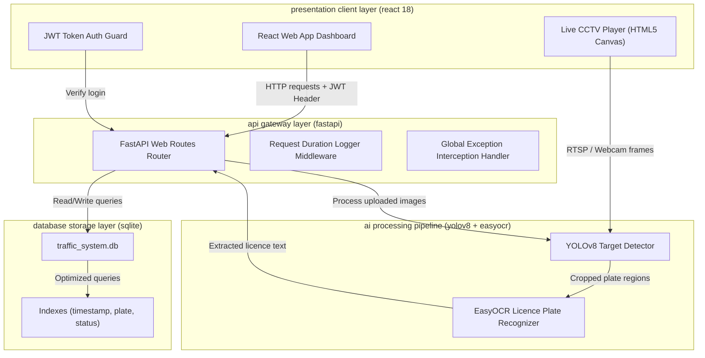

# 🏗️ System Architecture Diagram

This document illustrates the multi-tier architectural layout of the **Smart Traffic Violation Detection System (STVDS)**.

---

## 🗺️ Architectural Workflow

The system is organized into four main layers:
1. **Presentation Client Layer**: React single page application styled with Tailwind CSS, utilizing framer-motion transitions and Chart.js graphs.
2. **API Application Gateway**: FastAPI router managing JWT validations, file uploads, static directories, and database transaction queries.
3. **AI Pipeline Core Engine**: OpenCV frame processing, YOLOv8 target classifications, and EasyOCR character segmentation.
4. **Relational Database Storage**: Persisted SQLite/PostgreSQL schemas with performance indices on query search filters.

---

## 🎨 System Architecture Mermaid Representation

