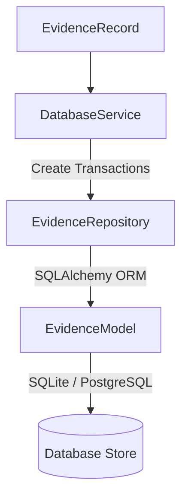

# Database Integration Layer

This document describes the design, implementation, and configurations of the Database Integration layer within the Traffic Violation system.

---

## 1. Purpose & Architecture

The Database Integration layer acts as the persistence foundation for all generated violation evidence. It consumes standardized `EvidenceRecord` objects from the pipeline and commits them to the database.

---

## 2. Entity Relationship & Models

### `EvidenceModel`
- **Table Name**: `evidences`
- **Fields**:
  - `id` (int, primary key)
  - `evidence_id` (str, unique UUID, index)
  - `violation_id` (str, index)
  - `tracking_id` (int, index)
  - `verified_plate` (str, index)
  - `vehicle_class` (int)
  - `violation_type` (str, index)
  - `severity` (str, index)
  - `timestamp` (float, index)
  - `frame_id` (int)
  - `camera_id` (str)
  - `location` (str)
  - `confidence` (float)
  - `original_frame_path` (str)
  - `annotated_frame_path` (str)
  - `vehicle_crop_path` (str, nullable)
  - `plate_crop_path` (str, nullable)
  - `hash` (str, unique file hash, index)
  - `metadata` (JSON column mapped to Python attribute `evidence_metadata` to avoid shadowing `Base.metadata`)
  - `created_at` (DateTime, index)
  - `updated_at` (DateTime)

---

## 3. Repository & Service Patterns

- **`EvidenceRepository`**: Encapsulates raw database queries (add, get, update, delete, filtering, search, pagination, statistics).
- **`DatabaseService`**: Manages session context, retry execution blocks, transaction safety, and idempotency checks.

### Idempotency & Duplicate Prevention
To prevent multiple pipeline runs from inserting duplicate records, the `DatabaseService` runs a lookup checking `evidence_id` and `hash` before committing. If a match is found, the write is skipped, and the existing database object is returned.

---

## 4. Configuration

Configuration keys managed in `.env` (copied to `.env.example`):
- `DATABASE_URL`: Defaults to `sqlite:///./traffic_system.db` for local development. Set to a PostgreSQL connection URI for production.
- `DB_POOL_SIZE`: Thread connection limit (default `5`).
- `DB_TIMEOUT`: Transaction query limit (default `30` seconds).
- `DB_MAX_RETRIES`: Resilient insert/update retry count (default `3`).
