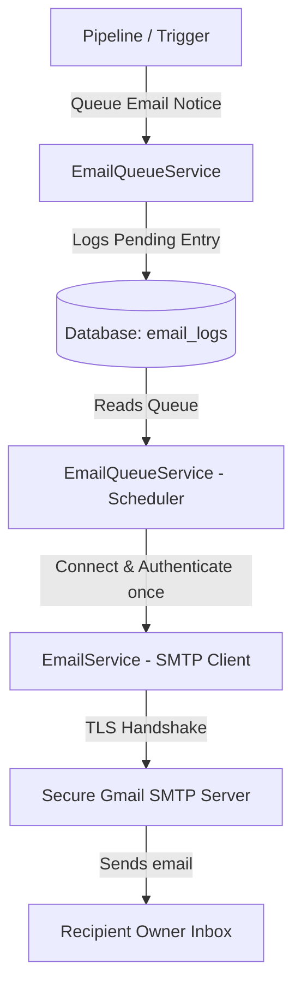

# Email Automation Module

This document outlines the architecture, configuration, security practices, and queue logic for the automated email notice dispatch layer in the Traffic Violation AI system.

---

## 1. Architecture & Flow

The Email Automation module acts as a secondary async processing stage. It processes generated evidence, renders HTML templates, appends crops as attachments, and routes messages via secure SMTP.

---

## 2. SMTP Configuration Settings

SMTP settings are defined dynamically in `backend/app/config.py` and read from environment configurations.

### Required Environment Keys
- `SMTP_HOST`: The SMTP server domain name (defaults to `smtp.gmail.com`).
- `SMTP_PORT`: SMTP port (defaults to `587` for TLS).
- `SMTP_EMAIL`: Sender address (defaults to `coderazze95@gmail.com`).
- `SMTP_APP_PASSWORD`: Google App Password (read from env only, never hardcoded).
- `SMTP_USE_TLS`: Upgrades session to TLS secure transport (defaults to `true`).
- `EMAIL_FROM`: Human-readable display header string (e.g. `Traffic Violation AI <coderazze95@gmail.com>`).
- `EMAIL_MAX_RETRIES`: Number of delivery attempts before marking as failed (default `3`).
- `EMAIL_RETRY_DELAY`: Seconds to wait between attempts (default `2.0`).

---

## 3. Database Queue & State Machine

Every email notice moves through the following database status states:

1. **`pending`**: Rendered and logged, awaiting processing.
2. **`sending`**: Currently being dispatched by the scheduler.
3. **`sent`**: SMTP server confirmed delivery without exceptions.
4. **`retrying`**: Temp failure occurred (e.g. connection timeout), scheduled for a retry up to `EMAIL_MAX_RETRIES` times.
5. **`failed`**: Limit exceeded; logging terminates and stores the last exception error detail.

---

## 4. Templates & HTML Generation

- **`Traffic Violation Notice`**: Fully structured HTML/CSS notification detailing Vehicle registration plate, location, exact datetime, confidence scoring, evidence ID, and instructional warning text with attached crops.
- **`Test Email`**: Used for network pings and connection verification.
- **`System Notification`**: Internal alerts for administrator.
- **`Delivery Failure Alert`**: Support desk notifications when an email fails to deliver.

---

## 5. Security & Best Practices
- **Credential Protection**: Application passwords and credentials are never hardcoded or printed inside debug logs.
- **Connection Reuse**: The queue processing scheduler opens the SMTP connection once per batch execution, optimizing performance and reducing network overhead.
- **File Validation**: Checks existence of original/annotated/cropped files on disk before constructing the MIME attachments.
