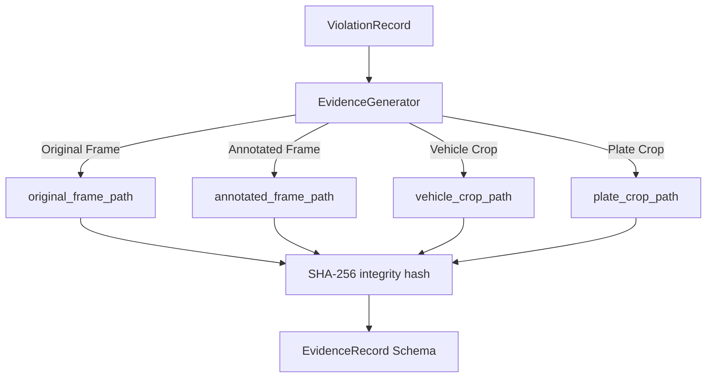

# Evidence Generator Service

This document describes the design, implementation, and configurations of the `EvidenceGenerator` service within the Traffic Violation AI pipeline.

---

## 1. Purpose & Architecture

The `EvidenceGenerator` is a business-layer coordination service that runs at the end of the AI processing pipeline (Stage 8). It consumes confirmed `ViolationRecord` events and matches them against the original/annotated frame frames and tracker bounding boxes to save a self-contained **Evidence Package** on disk.



---

## 2. Output Package Layout

Evidence packages are stored in a configurable output directory (`outputs/evidence/` by default). Each violation generates four files:
- **Original Frame**: `{evidence_id}_original.jpg` — Clean, unannotated full frame.
- **Annotated Frame**: `{evidence_id}_annotated.jpg` — Full frame with bounding boxes and labels overlaid.
- **Vehicle Crop**: `{evidence_id}_vehicle.jpg` — Bounding box crop of the violating vehicle.
- **Plate Crop**: `{evidence_id}_plate.jpg` — Bounding box crop of the vehicle's license plate (if plate detection succeeded).

---

## 3. Cryptographic Tamper-Proofing

To prevent evidence manipulation/tampering, a SHA-256 hash of the generated annotated frame is computed at write time and stored directly within the `EvidenceRecord.hash` field. This hash functions as a tamper-proof digital signature, verifying the authenticity of the visual evidence.

---

## 4. Configuration

Configured inside `configs/pipeline.yaml`:

```yaml
  evidence_generation:
    enabled: true
    output_dir: "outputs/evidence"
    image_format: "jpg"
    jpeg_quality: 90
    camera_id: "CAM_MUM_01"
    location: "GPS: 19.0760, 72.8777"
```

- **`output_dir`**: Directory where evidence packages are saved.
- **`jpeg_quality`**: Compression quality (1-100). Higher values reduce compression artifacts for OCR readiness.
- **`camera_id`**: Identifier of the camera source.
- **`location`**: Coordinates or address of the deployment junction.
