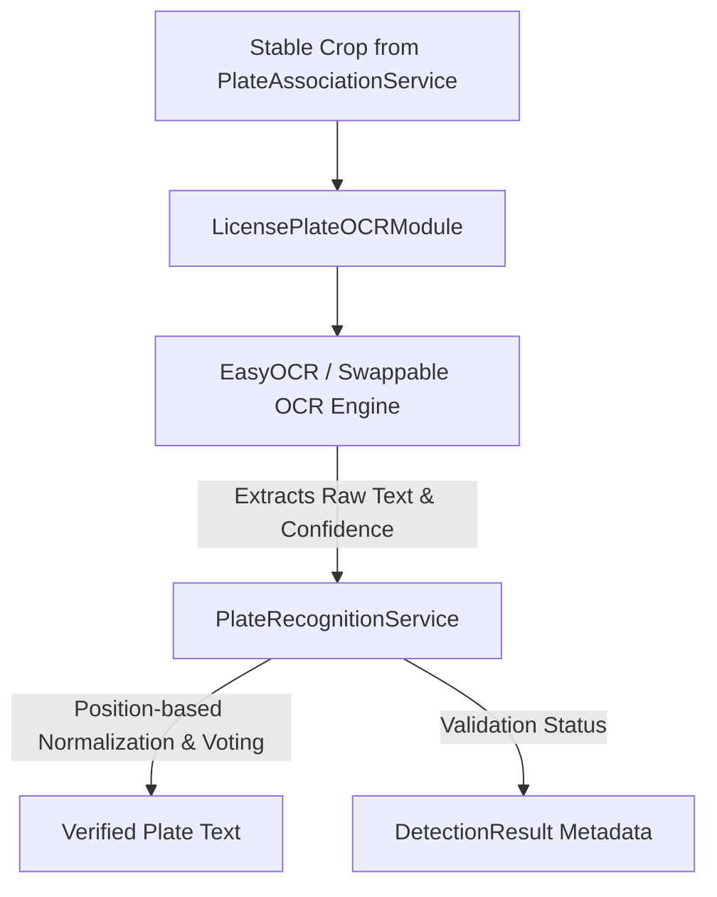

# OCR Integration (ANPR Stage 2)

This document describes the design, implementation, and configurations of the Optical Character Recognition (OCR) module within the Traffic Violation AI pipeline.

---

## 1. Architecture Overview

OCR Integration represents the second stage of the Automatic Number Plate Recognition (ANPR) system. It receives verified, high-quality, and temporally stable plate crop frames from `PlateAssociationService`, extracts the text sequence, and relies on `PlateRecognitionService` to vote, normalize, and validate the character sequences.



---

## 2. Shared Services & Core Responsibilities

To maintain a clean separation of concerns:
- **OCR Module (`license_plate_ocr.py`)**: Responsible only for loading the OCR engine, running text extraction on cropped plate arrays, and formatting the raw readings. It does NOT validate or clean the text.
- **PlateAssociationService**: Manages coordinates and matches plate boxes to vehicle tracking IDs, providing the stable cropped plate image.
- **PlateRecognitionService**: Manages the temporal history, positional character corrections (standard Indian registration layout), and multi-frame voting.

---

## 3. Supported Indian Registration Formats

Indian plates are validated by `PlateRecognitionService` and corrected based on index position:
- **State Code** (Positions 0, 1): Standard alphabets (e.g. `MH`, `DL`, `KA`).
- **District Code** (Positions 2, 3): Digits (e.g. `12`, `03`, `01`).
- **Series Letters** (Middle positions): Alphabet letters (e.g. `AB`, `CD`).
- **Registration Code** (Last 4 positions): Digits (e.g. `1234`, `0099`).

These positional mappings handle common digit/letter confusion pairs (e.g. `0` $\leftrightarrow$ `O`, `1` $\leftrightarrow$ `I`, `5` $\leftrightarrow$ `S`).

---

## 4. Pipeline Configurations

All OCR settings are configured inside `configs/pipeline.yaml`:

```yaml
  ocr:
    enabled: true
    ocr_engine: "easyocr"
    confidence_threshold: 0.50
    minimum_ocr_confidence: 0.50
    maximum_crop_rotation: 15.0
    batch_size: 4
    gpu: false
    language: "en"
```

### Swappable Engine Support
The architecture initializes the engine dynamically. Future support for `PaddleOCR`, `Tesseract`, or `TrOCR` can be added to the `initialize()` method of `LicensePlateOCRModule` without modifying the core pipeline process loop.

---

## 5. Verification & Unit Testing

Execute the test suite to verify the OCR module and recognition services:

```bash
# Run OCR specific tests
venv\Scripts\python -m pytest tests/unit/test_license_plate_ocr.py -v

# Run entire suite
venv\Scripts\python -m pytest tests/unit/ -v
```
