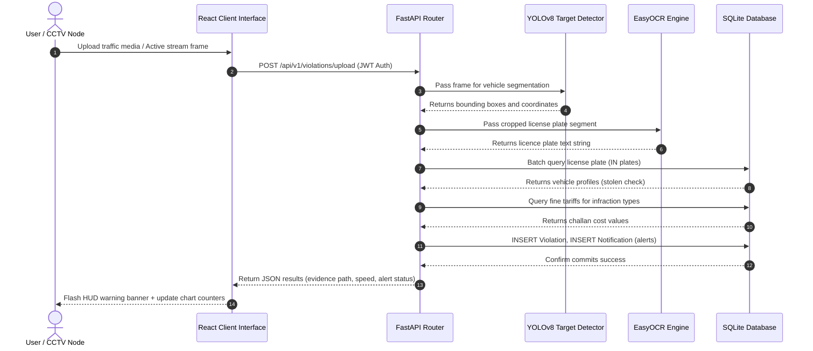

# 🔄 Project execution Flow Diagram

This document tracks the sequence of events that occur when a camera records a frame containing traffic violations or vehicles.

---

## 🚦 Processing Pipeline Execution Steps

1. **Frame Capture**: CCTV cameras capture video frames. Officers can also upload images/videos manually.
2. **AI Inference Pipeline**:
   - OpenCV decodes the media.
   - YOLOv8 isolates bounding boxes (cars, motorcycles, etc.).
   - EasyOCR reads license plate characters.
3. **Database Checks**:
   - Batch lookups find or create vehicle records.
   - Checks identify if the vehicle status is `"stolen"`.
4. **Tariff Assignment**: The system queries `fine_rules` for detected infraction types to calculate fine amounts.
5. **Incident Persistence**: The infraction is saved to the `violations` table.
6. **Notification Broadcast**: The backend commits a new row to `notifications` (automatically updates Topbar badges).
7. **Response rendering**: The dashboard charts and map components auto-refresh to reflect the new data.

---

## 🎬 Sequence Flow Mermaid Diagram

