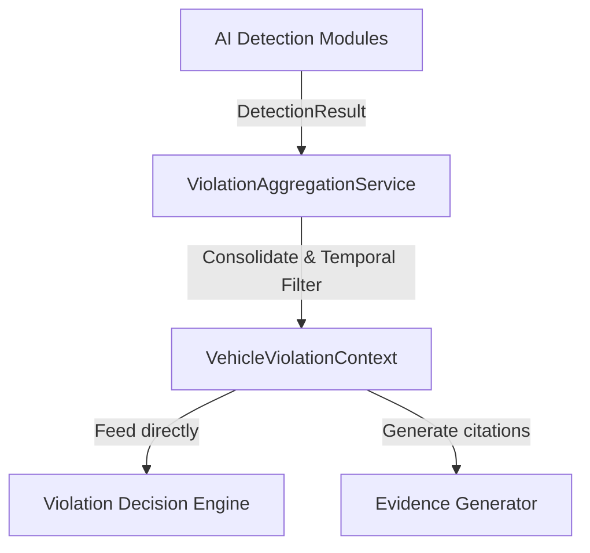

# Violation Aggregation Service

This document describes the design, implementation, and configurations of the `ViolationAggregationService` within the Traffic Violation AI pipeline.

---

## 1. Purpose & Architecture

The `ViolationAggregationService` serves as the central coordination layer that gathers individual, frame-level outputs from all active detection modules (Helmet, Seatbelt, Mobile Phone, Wrong Side, Traffic Light, Triple Riding, OCR) and merges them per tracked vehicle ID.

It acts as the single source of truth for downstream services:



---

## 2. Shared Models

### `ViolationHistoryEntry`
Represents a recorded instance of a single frame's violation detection. Used to keep track of a vehicle's historic violation events:
- `module_name`: Name of the module detecting the event.
- `status`: Classification (e.g., `"No Helmet"`).
- `confidence`: Bounding box or classification confidence score.
- `timestamp`: Time of detection.
- `frame_id`: Frame index.
- `tracking_id`: Associated vehicle tracker ID.
- `metadata`: Extra custom attributes.

### `VehicleViolationContext`
Unified state container representing the aggregation of all AI module outputs, temporal history, confidence, and verification states for a single tracked vehicle:
- **Statuses**: `helmet_status`, `seatbelt_status`, `phone_status`, `wrong_side_status`, `signal_status`, `triple_riding_status`.
- **Confidences**: Per-module confidence values.
- **Verification States**:
  - `verification_state`: `"Processing"`, `"Verified"`, or `"No Violation"`.
  - `evidence_ready`: Flag indicating if the context is ready for challan generation.
  - `stable_detection`: Flag indicating if the state is temporally stable.

---

## 3. Public APIs

The service exposes the following public APIs:
- `update_detection(tracking_id, module_name, status, confidence, timestamp, frame_id, metadata)`: Updates a single vehicle's context from a module result.
- `update_from_context(context)`: Automatically parses all tracking and module results from a `PipelineContext`.
- `get_context(tracking_id)`: Retrieves a vehicle's `VehicleViolationContext`.
- `get_all_contexts()`: Retrieves all active contexts.
- `clear_context(tracking_id)`: Clears a context.
- `remove_vehicle(tracking_id)`: Clears a context.
- `reset()`: Resets all contexts.
- `get_statistics()`: Aggregates system-wide statistics.

---

## 4. Configuration

Configured inside `configs/pipeline.yaml`:

```yaml
  violation_aggregation:
    history_length: 20
    minimum_confidence: 0.50
    minimum_frames: 3
    context_timeout: 5.0
    maximum_history: 50
    aggregation_weights:
      helmet: 0.80
      seatbelt: 0.80
      phone: 0.85
      wrong_side: 0.90
      signal: 0.90
      triple_riding: 0.85
```

- **`minimum_frames`**: Number of consecutive confirmation frames required before marking a violation status as `"Verified"`.
- **`context_timeout`**: Duration in seconds after which a vehicle's context is purged if it is no longer detected.
