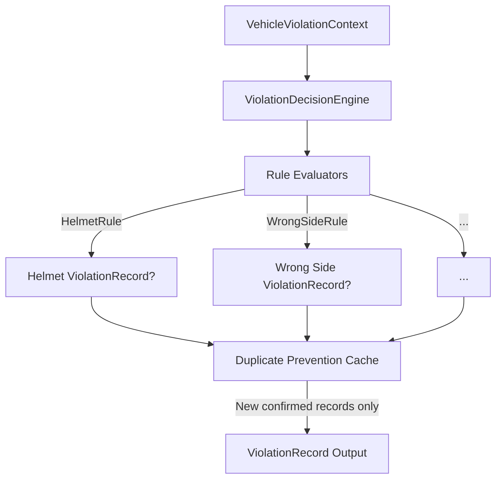

# Violation Decision Engine

This document describes the design, implementation, and configurations of the `ViolationDecisionEngine` within the Traffic Violation AI pipeline.

---

## 1. Purpose & Architecture

The `ViolationDecisionEngine` is a business rule evaluation service that processes aggregated `VehicleViolationContext` data (from `ViolationAggregationService`) and determines if a confirmed, pending, or rejected violation record should be issued.



---

## 2. Rule Architecture & Strategy Pattern

Each violation check is isolated into its own rule class implementing `BaseViolationRule`. This decoupling prevents large if-else blocks:
- **`HelmetRule`**: Checks for `"No Helmet"` status above the confidence threshold.
- **`SeatBeltRule`**: Checks for `"No Seat Belt"` status.
- **`MobilePhoneRule`**: Checks for `"Mobile Phone"` status.
- **`WrongSideRule`**: Checks for `"Wrong Side"` driving direction.
- **`TrafficSignalRule`**: Checks for `"Red Light Jump"`.
- **`TripleRidingRule`**: Checks for motorcycle occupancy exceeding two riders.

---

## 3. Pydantic Model: `ViolationRecord`

The output of the engine is a list of strongly typed `ViolationRecord` objects:
- `violation_id`: UUID string unique to the event.
- `tracking_id`: Bounding box track ID of the vehicle.
- `verified_plate`: License plate string.
- `violation_type`: E.g. `"No Helmet"`.
- `severity`: `"Low"`, `"Medium"`, `"High"`, or `"Critical"`.
- `confidence`: Aggregated confidence score.
- `decision_status`: `"Confirmed"`, `"Pending"`, `"Rejected"`, or `"Unknown"`.
- `rule_id`: Identifier of the rule triggering the decision.

---

## 4. Configuration

Thresholds and severities are defined in `configs/pipeline.yaml`:

```yaml
  violation_engine:
    enabled: true
    confidence_threshold: 0.50
    minimum_decision_confidence: 0.50
    helmet_threshold: 0.50
    seatbelt_threshold: 0.50
    phone_threshold: 0.50
    wrong_side_threshold: 0.50
    signal_threshold: 0.50
    triple_riding_threshold: 0.50
    severities:
      helmet: "Medium"
      seatbelt: "Low"
      phone: "Medium"
      wrong_side: "High"
      signal: "Critical"
      triple_riding: "High"
```

---

## 5. Duplicate Prevention

To prevent frame-level spamming, the engine caches active confirmed violations in `active_violations` keyed by vehicle track ID. Once a violation is confirmed, no new `ViolationRecord` will be created for that vehicle-violation pair on subsequent frames until the violation is resolved (e.g. the vehicle leaves the camera frame or complies).
